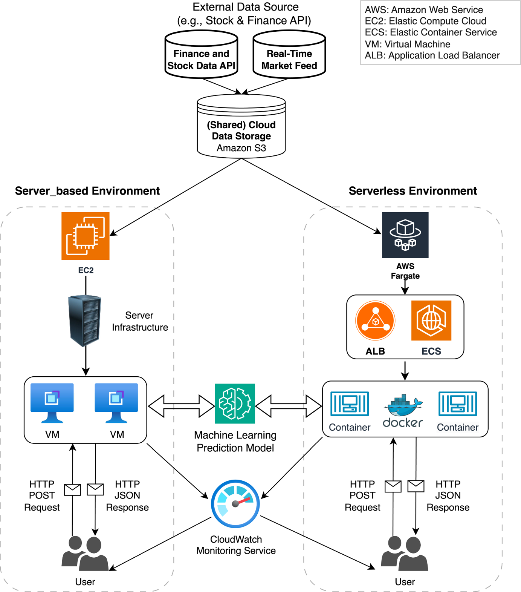

<h1 align="center">StockAICloud: AI‑based sustainable and scalable stock price prediction framework using serverless cloud computing</h1>

## Abstract
The inherent volatility of the stock market presents significant challenges for accurate price forecasting, influenced by factors such as market sentiment, economic indicators, and geopolitical events. In this paper, we propose an Artificial Intelligence (AI)-based stock price prediction framework, StockAICloud, built with FastAPI to offer scalable and sustainable services via serverless cloud computing. The StockAICloud framework focuses on HDFC Bank’s stock and forecasts both open and close prices for future dates, using historical data obtained from Yahoo Finance. StockAICloud employs three deep learning models, including long short-term memory (LSTM), gated recurrent units (GRU), and convolutional neural networks (CNN), with experimental results showing that the LSTM model achieved the highest performance (R² = 0.9106), making it the preferred choice for deployment. Further, StockAICloud was deployed on both server-based and serverless cloud environments. The serverless deployment on amazon web services (AWS) Fargate demonstrated superior scalability under high concurrency, achieving a maximum throughput of 21.2 requests per minute with 400 concurrent requests. These findings underscore the potential of integrating deep learning models with scalable serverless cloud services to deliver sustainable and real-time stock price predictions.

<div align="center">
    
</div>

## Cite this work
Our work is published in The Journal of Supercomputing, cite using the following bibtex entry:
```bibtex
@article{StockAICloud,
	title = {{StockAICloud}: {AI}-based sustainable and scalable stock price prediction framework using serverless cloud computing},
	volume = {81},
	doi = {10.1007/s11227-025-06984-7},
	number = {4},
	journal = {The Journal of Supercomputing},
	author = {Wang, Han and Rajakumar, Vidhyaa Shree and Golec, Muhammed and Gill, Sukhpal Singh and Uhlig, Steve},
	month = feb,
	year = {2025},
	pages = {527}}
```
## License
This project is licensed under the MIT License - see the [LICENSE](LICENSE.txt) file for details.